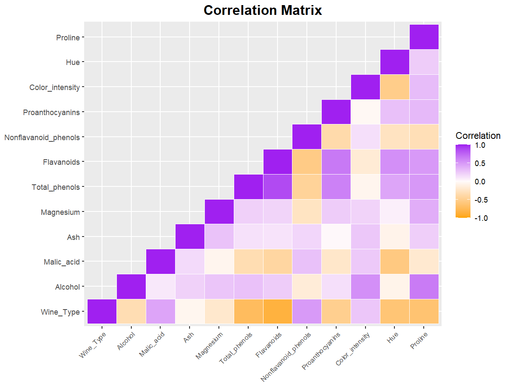

# Neural Network (Classification) & Data Visualizations in R

This project walks you through how to train a Neural Network for Classification purposes in R. 
It also includes some data preparation and useful visualizations. 

-------------------

```R
##############  TRAIN NEURAL NETWORK FOR CLASSIFICATION ##############
library(Rcpp)
library(RSNNS)
nn <- mlp(x = X_train, # raining inputs for the network
          y = Y_train, # corresponding targets values
          size = c(10,5), # number of units in the hidden layer(s)
          maxit = 200, # maximum of iterations (epochs) to learn
          inputsTest = X_test, # inputs to test the network
          targetsTest = Y_test) # targets for the test input

############## PLOT NEURAL NETWORK ##############
library(NeuralNetTools)
plotnet(mod_in = nn, # neural network object
        rel_rsc = c(1, 7), # scaling range for the width of connection weights
        alpha_val = 0.3, # transparency of connections, default 1
        circle_col = "lightblue", # color of nodes
        pos_col = "green", # positive connection weights
        neg_col = "red", # negative connection weights
        max_sp = TRUE # space between nodes in each layer is maximized
        )
```

<p align="center" width="100%">
	
</p>

-----------------------

```R
############## EVALUATE RELATIONSHIP BETWEEN SPECIFIC VARIABLES ##############
library(ggplot2)
library(dplyr)
library(viridis)
library(RColorBrewer)

# order the data by the variable that is used for sizing bubbles (descending order)
# makes sure that largest bubbles are plotted first...
data_ordered <- data[order(-data$Proline), ]

# factorize wine types as the variable used for coloring the bubbles
Wine_Types <- as.factor(data$Wine_Type)

ggplot(data_ordered, aes(x=Flavanoids, y=Alcohol, size = Proline, color = Wine_Types, fill = Wine_Types)) +
  geom_point(alpha = 0.5) +
  scale_size(range = c(.1, 16), name="Proline")+
  ggtitle("Wine Types") + 
  #scale_color_viridis(discrete = TRUE, option="viridis") + 
  scale_colour_brewer(palette = "Dark2") +
  theme_minimal() +
  guides(color = guide_legend(override.aes = list(size = 5))) +
  theme(plot.title = element_text(hjust = 0.5, size = 16, face = "bold"),
        panel.background = element_rect(fill = "white", color = 'black', linewidth = 1.0),
        panel.grid.major = element_line(color = 'grey', linetype = 'dotted', linewidth = 0.5),
        panel.grid.minor = element_line(color = 'grey', linetype = 'dotted', linewidth = 0.5),
        legend.position = "right",
        legend.background = element_rect(fill = "white", # Background
                                         linetype = 'dashed',
                                         colour = 1))
```

<p align="center" width="100%">
	
</p>

------------------

```R
############## EVALUATE CORRELATIONS BETWEEN VARIABLES ##############
library(ggplot2)
cor_matrix <- cor(data)
cor_matrix[upper.tri(cor_matrix)] <- NA
cor_matrix <- reshape2::melt(cor_matrix, na.rm = TRUE)

ggplot(data = cor_matrix, aes(x=Var1, y=Var2, fill=value)) + 
  ggtitle("Correlation Matrix") +
  geom_tile(color = "white") +
  scale_fill_gradient2(low = "orange", high = "purple", mid = "seashell1", 
                       midpoint = 0, limit = c(-1,1), space = "Lab", 
                       name="Correlation") +
  theme(axis.title.x = element_blank(),
        axis.title.y = element_blank(),
        plot.title = element_text(hjust = 0.5, size = 16, face = "bold"),
        axis.text.x = element_text(angle = 45, vjust = 1, 
                                   size = 8, hjust = 1))
```

<p align="center" width="100%">
	
</p>

------------------

```R

############## RADARPLOT WITH STANDARDIZED [0-1] VARIABLE MEANS ############## 
library(fmsb)

# X = matrix with standardized values by variable
temp <- aggregate(X, list(data$Wine_Type), FUN=mean) # extract means for each variable and groub by categorical target variable
rownames(temp) <- c("Wine Type #1", "Wine Type #2", "Wine Type #3")
temp <- temp[2:length(colnames(temp))] # exclude target variable
temp <- rbind(rep(max(temp),length(colnames(temp))), rep(min(temp),length(colnames(temp))), temp) # set minimum and maximum values for the plot

# Color vector
colors_border=c( rgb(0.2,0.5,0.5,0.9), rgb(0.8,0.2,0.5,0.9) , rgb(0.7,0.5,0.1,0.9) )
colors_in=c( rgb(0.2,0.5,0.5,0.4), rgb(0.8,0.2,0.5,0.4) , rgb(0.7,0.5,0.1,0.4) )

# plot with default options:
radarchart(temp, 
           axistype = 0,
           seg = 6, # number of segments. 4 is default.
           pty = 16, # point symbol. 16 is default.
           pcol = colors_border, 
           pfcol = colors_in, 
           plwd = 2, # linethickness 
           plty = 1, # linestyle
           vlcex = 0.5, 
           centerzero = TRUE,
           title = "Standardized [0-1] Variable Means") 

# Create a legend for the radarplot
legend(x = 1.5, # x-offset
       y = 0.2, # y-offset
       legend = rownames(temp)[3:length(rownames(temp))], 
       bty = "n", # "n" for no boundingbox | "o" for boundingbox
       pch = 20 , # plotting symbols
       col = colors_in, # colors 
       text.col = "grey", # text color
       cex = 0.9, # font size
       pt.cex = 2) # point size
```

<p align="center" width="100%">
	
</p>
